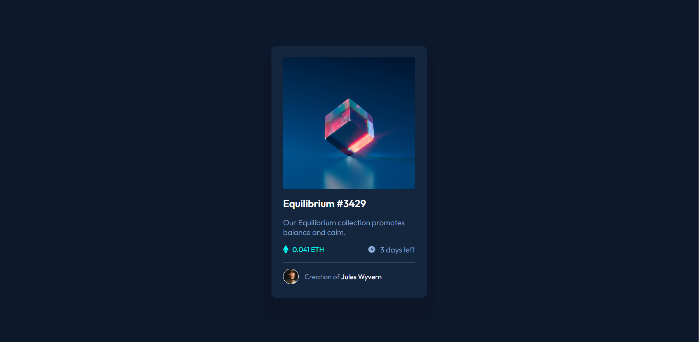
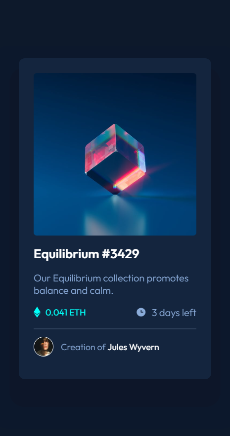
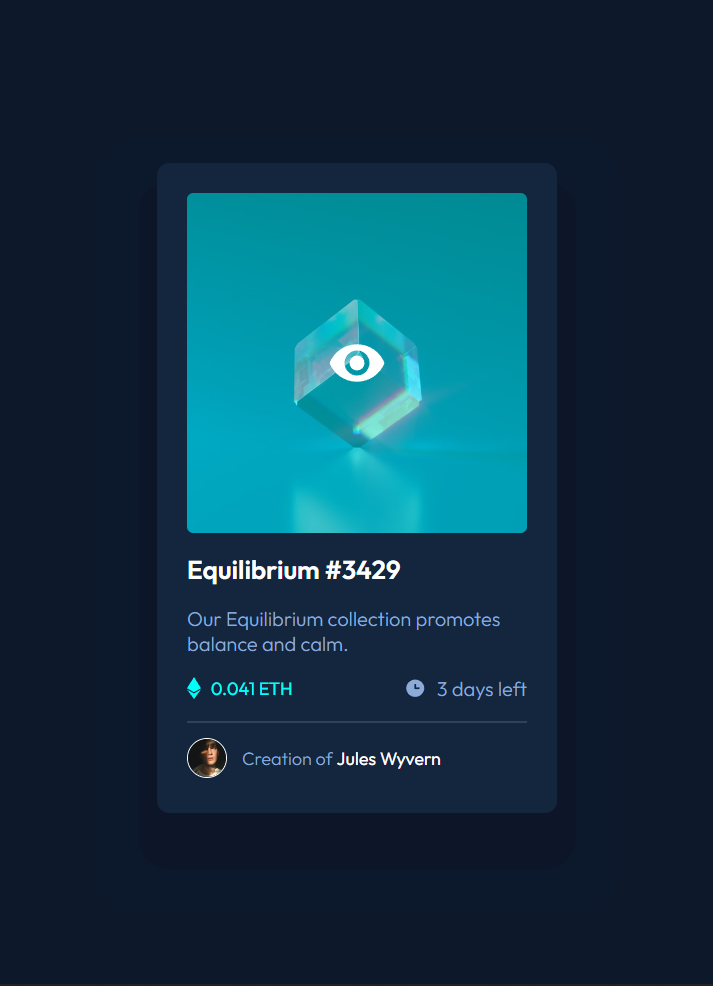

# Frontend Mentor - NFT preview card component solution

This is a solution to the <a href="https://www.frontendmentor.io/challenges/nft-preview-card-component-SbdUL_w0U" target="_blank">NFT preview card component challenge on Frontend Mentor</a>. Frontend Mentor challenges help you improve your coding skills by building realistic projects.

## Table of contents

- [Overview](#overview)
  - [The challenge](#the-challenge)
  - [Screenshot](#screenshot)
  - [Links](#links)
- [Built with](#built-with)
- [Author](#author)

## Overview

### The challenge

Users should be able to:

- View the optimal layout depending on their device's screen size
- See hover states for interactive elements

### Screenshot

### Links

- Solution URL: [Frontend Mentor](https://www.frontendmentor.io/solutions/nft-card-component-using-css-flexbox-klxjrOBUEK)
- Live Site URL: [GitHub Pages](https://nandanholla.github.io/nft-card-component/)

## Built with

- HTML5
- <a href="https://sass-lang.com/" target="_blank">Sass</a> - CSS pre-processor
- Flexbox

## Author

- <a href="https://www.frontendmentor.io/profile/nandanholla" target="_blank">Frontend Mentor</a>
- <a href="https://www.twitter.com/nandanholla" target="_blank">Twitter</a>
